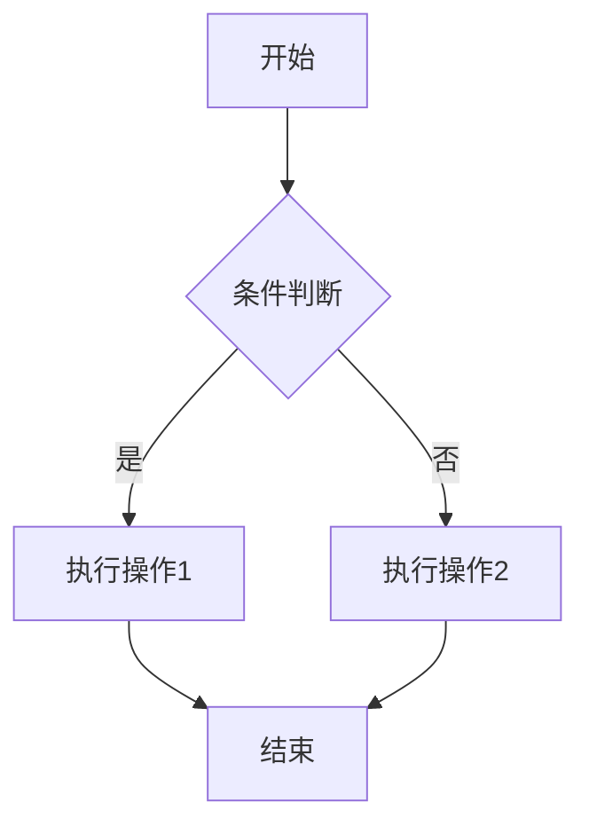
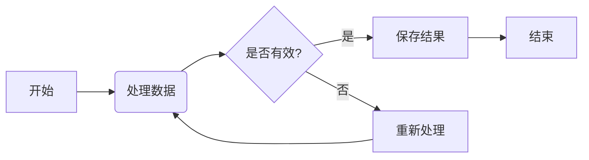
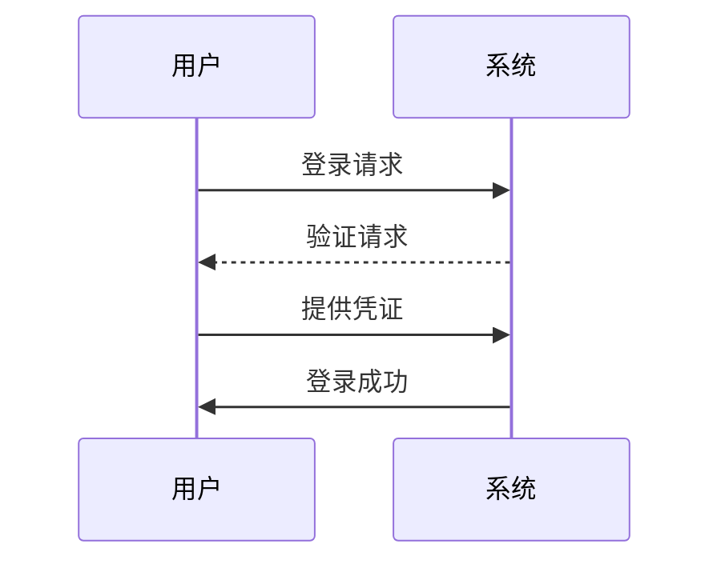
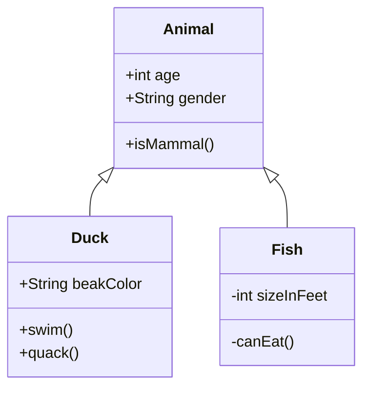
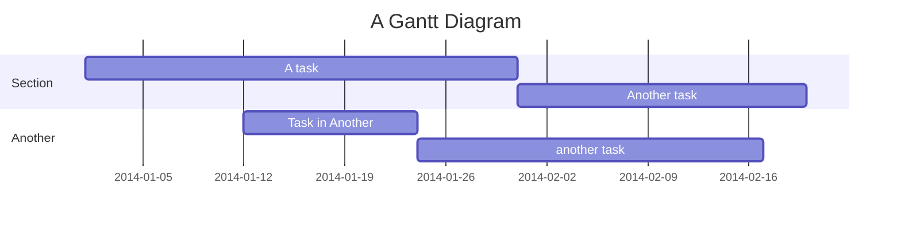
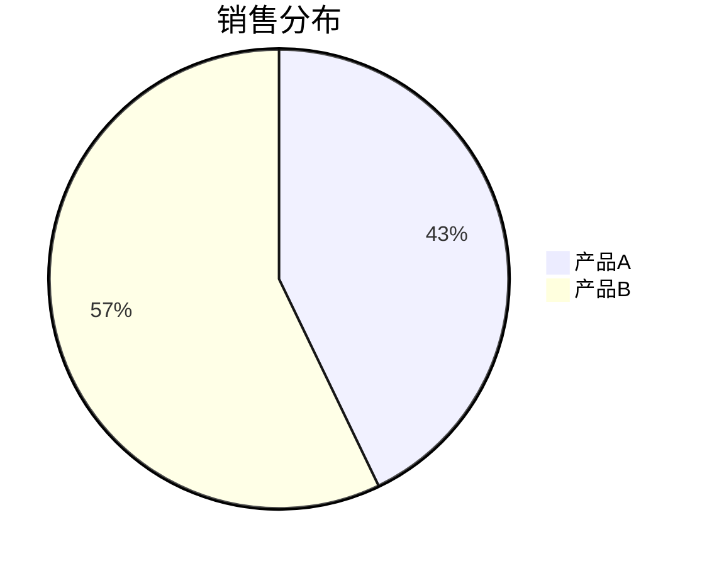
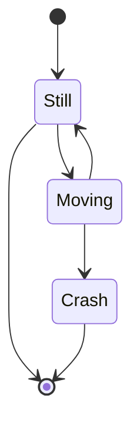
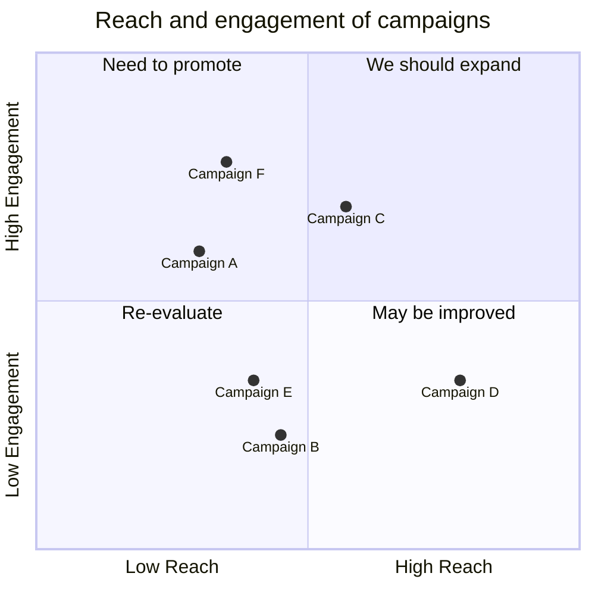
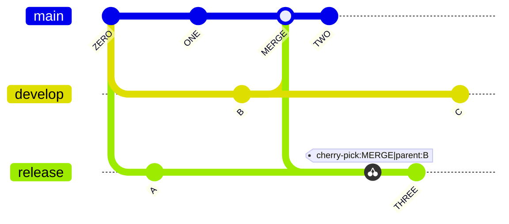

# AI 时代的文档格式<br>Markdown 扩展语法和生态介绍

探索 AI 时代下 Markdown 的发展和生态系统

<div @click="$slidev.nav.next" class="mt-12 py-1" hover:bg="white op-10">
  点击或按空格键继续 <carbon:arrow-right />
</div>

<!--
这是幻灯片的首页，介绍主题为"AI时代的文档格式——Markdown的扩展语法和生态介绍"
-->

---

# 目录

Contents

---
layout: section
---

# Markdown 简介与历史

Introduction to Markdown

---

# Markdown 简介

Introduction to Markdown

什么是 Markdown？

<v-clicks>

- **轻量级标记语言** - 易读易写的纯文本格式
- **易于转换** - 可转换为有效的 XHTML 或 HTML 文档
- **专注内容** - 让作者专注于写作而非格式

</v-clicks>

---

# Markdown 历史发展

- 2004 年由 John Gruber 创建
- 设计目标是尽可能易读、易写
- 受到 Markdown 启发的众多变种和扩展

<Note>
Markdown 的设计目标是让普通人也能轻松进行格式化写作
</Note>

---
layout: section
---

# AI 时代对文档格式的新需求

New Requirements in the AI Era

---

# AI 驱动的文档处理

- **语义理解** - AI 需要更好地理解文档结构和内容
- **自动化生成** - AI 能够自动生成结构化文档
- **智能交互** - 文档不仅是静态内容，还能与用户互动

---

# 协作与分享需求

- **实时协作** - 多人同时编辑和评论
- **跨平台兼容** - 在不同设备和系统间无缝切换
- **版本控制** - 清晰的变更历史和回溯能力

---

# 可扩展性要求

- **自定义语法** - 满足特定领域需求
- **插件生态** - 丰富的扩展功能
- **工具链整合** - 与开发工具和流程深度集成

---
layout: section
---

# Markdown 原生语法

Markdown Native Syntax

---

# 表格

Tables

用于展示结构化数据，比传统文档中的表格更易维护和版本控制

```markdown
| 姓名 | 年龄 | 职业   |
| ---- | ---- | ------ |
| 张三 | 25   | 工程师 |
| 李四 | 30   | 设计师 |
```

显示效果：

| 姓名 | 年龄 | 职业   |
| ---- | ---- | ------ |
| 张三 | 25   | 工程师 |
| 李四 | 30   | 设计师 |

---

# 任务列表

Task Lists

用于创建待办事项清单，支持勾选状态，非常适合项目管理和进度跟踪

```markdown
- [x] 完成项目规划 // 已完成
- [ ] 编写技术文档 // 未完成
- [ ] 进行代码审查
```

---

# 代码块和代码高亮

Code Blocks and Code Highlighting

Markdown 支持语法高亮和行号显示，对技术文档尤为重要。

````markdown
\```cpp
int add(int a, int b) {
return a + b;
}
\```
````

显示效果

```cpp
int add(int a, int b) {
  return a + b;
}
```

---

## 脚注 (Footnotes)

<br>

为文档添加注释和引用，提高内容的可信度和完整性

```markdown
这是一个带有脚注的句子[^1]

[^1]: 这是脚注的内容
```

---

# 元数据

Front Matter

为 AI 处理提供上下文信息，便于内容分类和检索。

```markdown
---
title: 文档标题
author: 作者姓名
tags: [标签1, 标签2]
date: 2023-01-01
---
```

---

# 注释和标签

Comments and Tags

便于内容分类和检索，提高文档的可管理性

```markdown
<!-- 这是一个注释，不会在最终文档中显示 -->
```

---

# Markdown 扩展语法

Markdown Expansion Syntax

除了 Markdown 原生语法外，Markdown 还支持一些扩展语法。

这些扩展语法不断扩展 Markdown 的能力边界，形成了富有生命力的文档格式。

## 扩展语法示例

### 1. 表格增强

支持合并单元格和复杂表头

```markdown
| 项目       | 描述          | 状态 |
| ---------- | ------------- | ---- |
| 任务1      | 完成需求分析  | ✅   |
| 任务2      | 开发核心功能  | 🚧   |
| 任务3      | 测试与优化    | ❌   |
```

### 2. 流程图增强

支持更多图形类型和交互



### 3. 数学公式增强

支持更复杂的数学符号和公式

$$
\int_{-\infty}^\infty e^{-x^2} dx = \sqrt{\pi}
$$

### 4. 自定义容器

支持警告、提示等自定义容器

```markdown
::: warning
这是一个警告信息
:::

::: tip
这是一个提示信息
:::
```

---

# 数学公式语法

Mathematical Formulas

使用 LaTeX 语法，支持行内公式和块级公式，适合学术和科研文档

行内公式: $E = mc^2$

块级公式:

$$
\frac{\partial}{\partial t}\Psi(\mathbf{r},t) = \frac{i}{\hbar}\hat{H}\Psi(\mathbf{r},t)
$$

---
transition: fade
---

# 图表支持语法

Diagrams

使用 Mermaid 扩展语法，可直接在 Markdown 中创建流程图、时序图等。

Mermaid 语法的使用方式和代码块类似，代码块的 language 属性设置为 mermaid 即可。

````text {monaco}
\```mermaid
  # 这里写 Mermaid 代码
\```
````

---
transition: fade
---

# 流程图示例

<br>

```text
graph LR
  A[Hard edge] --> B(Round edge)
  B --> C{Decision}
  C --> D[Result one]
  C --> E[Result two]
```



---
transition: fade
---

# 时序图示例：

<br>

<Cols :cols="2">

```text
sequenceDiagram
  participant A as 用户
  participant B as 系统
  A->>B: 登录请求
  B->>A: 登录成功
```



</Cols>

---
transition: fade
---

# 类图示例：

<br>

<Cols :cols="2">

```text
classDiagram
  Animal <|-- Duck
  Animal <|-- Fish
  Animal: +int age
  Animal: +String gender
  Animal: +isMammal()
  class Duck{
    +String beakColor
    +swim()
    +quack()
  }
  class Fish{
    -int sizeInFeet
    -canEat()
  }
```



</Cols>

---
transition: fade
---

# 甘特图

gantt

<br>

```text
gantt
    title A Gantt Diagram
    dateFormat YYYY-MM-DD
    section Section
        A task          :a1, 2014-01-01, 30d
        Another task    :after a1, 20d
    section Another
        Task in Another :2014-01-12, 12d
        another task    :24d
```



---
transition: fade
---

# 饼图示例：

<br>

<Cols :cols="2">

```text
pie title 销售分布
  "产品A" : 42.86
  "产品B" : 57.14
```



</Cols>

---

## transition: fade

状态图示例：

<br>

<Cols :cols="2">

```text
stateDiagram
  [*] --> Still
  Still --> [*]
  Still --> Moving
  Moving --> Still
  Moving --> Crash
  Crash --> [*]
```



</Cols>

---

# 象限图

quadrantChart

<Cols :cols="2">

```text
quadrantChart
    title Reach and engagement of campaigns
    x-axis Low Reach --> High Reach
    y-axis Low Engagement --> High Engagement
    quadrant-1 We should expand
    quadrant-2 Need to promote
    quadrant-3 Re-evaluate
    quadrant-4 May be improved
    Campaign A: [0.3, 0.6]
    Campaign B: [0.45, 0.23]
    Campaign C: [0.57, 0.69]
    Campaign D: [0.78, 0.34]
    Campaign E: [0.40, 0.34]
    Campaign F: [0.35, 0.78]
```



</Cols>

---

# Git 图

git graph


<Cols :cols="2">

```text
gitGraph
    commit id: "ZERO"
    branch develop
    branch release
    commit id:"A"
    checkout main
    commit id:"ONE"
    checkout develop
    commit id:"B"
    checkout main
    merge develop id:"MERGE"
    commit id:"TWO"
    checkout release
    cherry-pick id:"MERGE" parent:"B"
    commit id:"THREE"
    checkout develop
    commit id:"C"
```



</Cols>


---

# AI 增强功能

---

# 标题 {#custom-id .class-name}

````

### 引用和链接 (References and Links)

建立知识网络，便于 AI 理解文档间的关系

```markdown
这是一个[内部链接](#章节标题)和[外部链接](https://example.com)

> 这是一个引用块，常用于引用他人观点
````

```

```

---

# Markdown 生态系统

# Markdown Ecosystem

<br>

## 编辑器工具

- **Typora** - 所见即所得 Markdown 编辑器
- **Obsidian** - 知识管理和笔记应用
- **Mark Text** - 开源 Markdown 编辑器
- **Zettlr** - 学术写作专用编辑器
- **Notion** - 集成文档和项目管理
- **Logseq** - 支持双向链接的知识库工具
- **Joplin** - 开源跨平台笔记应用

### VS Code 及其 Markdown 扩展

- **Markdown All in One** - 提供快捷键、自动预览、目录生成等功能
- **Markdown Preview Enhanced** - 增强的 Markdown 预览功能，支持数学公式、图表等
- **Markdownlint** - Markdown 语法检查和规范工具
- **Markdown Table Formatter** - 表格自动格式化
- **Markdown Emoji** - 支持 Emoji 表情符号
- **Markdown PDF** - 将 Markdown 文档导出为 PDF 格式
- **Paste Image** - 方便在 Markdown 中插入图片
- **Auto-Open Markdown Preview** - 自动打开 Markdown 预览窗口
- **Foam** - 支持 Wiki 式链接的知识管理

## 在线协作平台

- **GitHub/GitLab** - 代码托管和文档协作
- **HackMD** - 实时协作 Markdown 编辑器
- **StackEdit** - 在线 Markdown 编辑器
- **Dillinger** - 简单易用的在线编辑器

## 静态网站生成器

- **Hugo** - 快速生成静态网站
- **Jekyll** - GitHub Pages 默认生成器
- **Gatsby** - 基于 React 的现代网站生成器
- **Docusaurus** - 专注于文档的静态网站工具

<br>

## 替代 Office 套件的工具

### 替代 Word 的文档工具

- **Markdown** - 专注于内容创作的纯文本格式
- **Typora/Obsidian** - 提供所见即所得的编辑体验
- **HackMD/CodiMD** - 在线协作 Markdown 编辑器

### 替代 Excel 的表格和数据工具

- **CSV/TSV 文件** - 简单的纯文本表格格式
- **Markdown 表格** - 内联表格语法
- **Jupyter Notebook** - 数据科学和分析环境
- **Airtable** - 结合数据库和电子表格功能

### 替代 PowerPoint 的演示工具

- **Slidev** - 我们正在使用的演示文稿工具
- **Marp** - Markdown 转换为幻灯片
- **Reveal.js** - HTML 演示框架，支持 Markdown
- **Remark.js** - 简单的 Markdown 幻灯片工具

<br>

## 转换和发布工具

- **Pandoc** - 万能文档转换器
- **Hugo** - 静态网站生成器
- **Jekyll** - 博客感知静态网站生成器
- **Slidev** - 我们正在使用的演示文稿工具

## Markdown 与其他技术的整合

- **React + Markdown** - 使用 MDX 实现动态文档
- **Python + Markdown** - 自动化文档生成和处理
- **SQL + Markdown** - 数据报告的可视化展示
- **Docker + Markdown** - 容器化文档部署
- **CI/CD + Markdown** - 自动化文档发布流程

<br>

## 协作和版本控制

- **Git** - 版本控制系统的完美搭档
- **GitHub/GitLab** - 在线协作平台
  - **Markdown + Issues** - 用Markdown编写清晰的问题描述
  - **Markdown + Wiki** - 构建项目知识库
  - **Markdown + MR/PR** - 格式化代码审查说明
  - **Markdown + CI/CD** - 自动化文档生成与发布
- **Notion** - 集成文档和项目管理

---

# 实际应用案例

# Real-world Applications

<br>

## 技术文档

- **API 文档** - 使用 Markdown 编写，自动生成
- **开发手册** - 团队内部知识库
- **开源项目** - README 和 Wiki
  - **GitHub Pages** - 自动发布Markdown文档为网站
  - **GitLab Wiki** - 版本化文档协作
  - **PR模板** - 标准化代码提交说明

<br>

## 学术和教育

- **课程材料** - 教案、讲义、作业
- **学术论文** - 配合工具链实现公式和引用
- **在线教育** - MOOC 平台内容

<br>

## 商业应用

- **产品文档** - 用户手册、帮助文档
- **内容营销** - 博客、白皮书、案例研究
- **内部沟通** - Wiki、会议记录

## AI 增强应用

- **智能文档生成** - AI 自动生成 Markdown 内容
- **语义搜索** - 基于 Markdown 的 AI 搜索优化
- **自动化翻译** - AI 驱动的多语言文档转换

---

# 未来展望

# Future Perspectives

<br>

## AI 与 Markdown 的深度融合

- **智能写作助手** - 根据上下文提供语法建议
- **自动格式化** - 根据内容类型自动应用样式
- **语义增强** - 自动添加元数据和标签
- **AI 内容生成** - 基于 GPT 的 Markdown 文档自动生成
- **智能摘要** - 自动提取文档关键内容生成摘要
- **多语言翻译** - 实时翻译并保持格式不变

<br>

## 新兴技术整合

- **WebAssembly** - 更强大的本地处理能力
- **区块链** - 文档确权和溯源
- **AR/VR** - 沉浸式文档体验
- **知识图谱** - 自动构建文档间的语义关系
- **低代码平台** - 通过 Markdown 生成可视化应用

## AI 驱动的 Markdown 工具

- **Copilot for Docs** - AI 辅助编写技术文档
- **Markdown Auto-Completion** - 基于上下文的智能补全
- **AI-Powered Linting** - 智能检测和修复格式问题
- **Semantic Search** - 基于内容的智能搜索和推荐

<br>

## 标准化和互操作性

- **统一扩展语法** - 减少碎片化
- **跨平台兼容** - 更好的互操作性
- **生态系统整合** - 工具链无缝衔接

---

# 总结

# Conclusion

<br>

## Markdown 的核心优势

- **简洁易用** - 专注于内容创作
- **广泛支持** - 几乎所有平台都支持
- **易于扩展** - 丰富的生态系统

<br>

## AI 时代的机遇

- **智能化处理** - 更好的语义理解和生成
- **自动化工具** - 提高创作效率
- **协作增强** - 更好的团队协作体验

<br>

## 展望

Markdown 作为轻量级标记语言，在 AI 时代将继续发挥重要作用，其简单性和可扩展性使其成为理想的文档格式选择。

---

## layout: end

# 感谢聆听！

Thank You!

```

```
