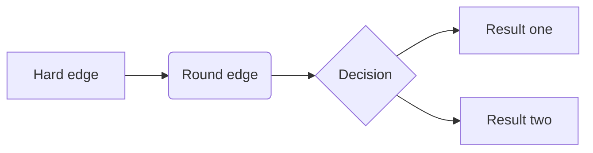
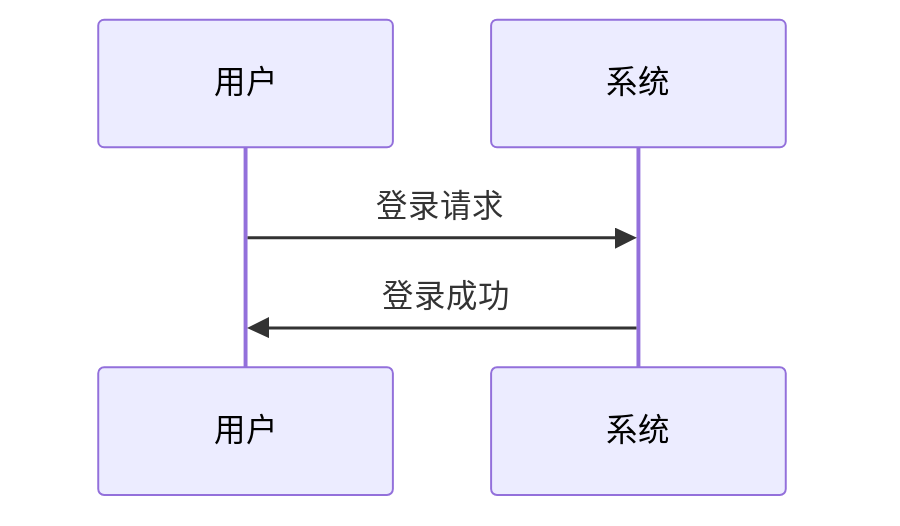
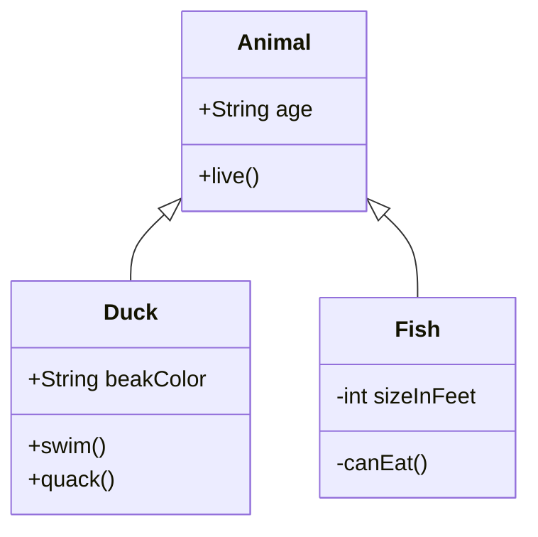
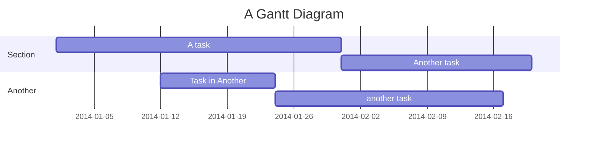
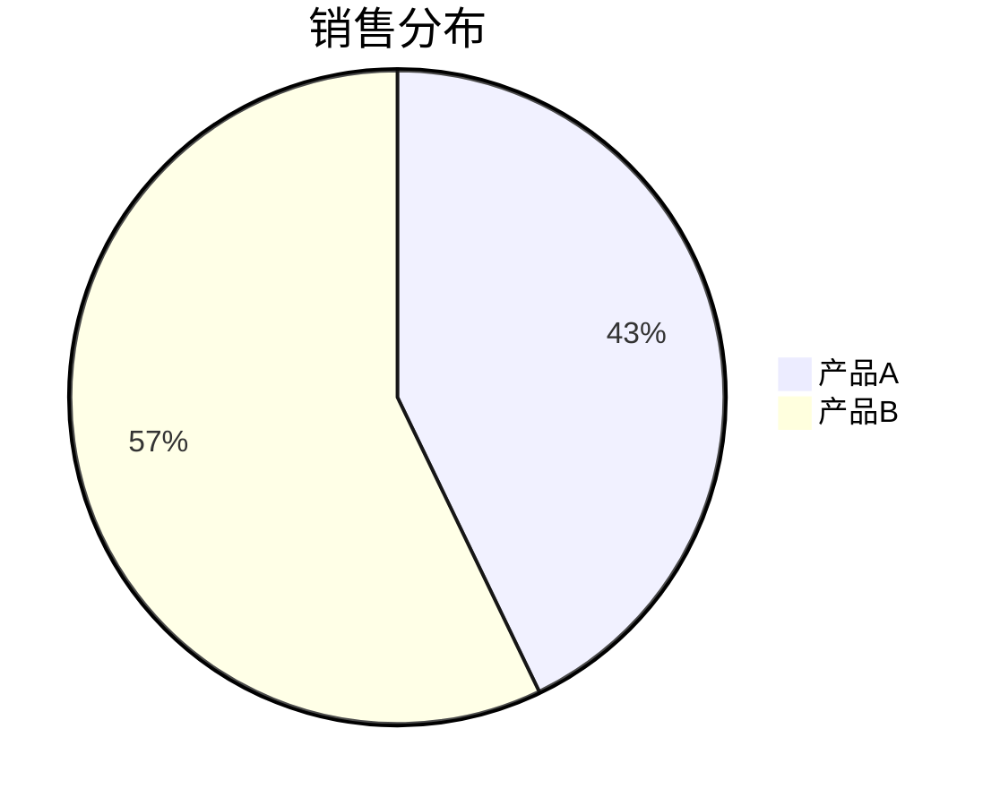
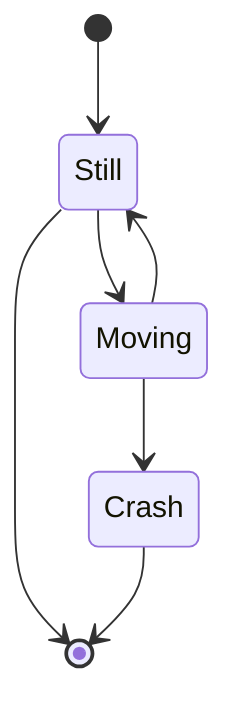
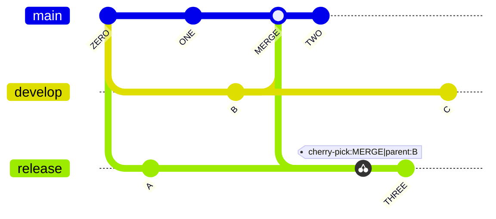

# AI 时代的文档格式

<h2>Markdown 扩展语法和生态介绍</h2>

<div @click="$slidev.nav.next" class="mt-12 py-1" hover:bg="white op-10">
  点击或按空格键继续 <carbon:arrow-right />
</div>

<!--
这是幻灯片的首页，介绍主题为"AI时代的文档格式——Markdown的扩展语法和生态介绍"
-->

---
layout: section
---

# Markdown 简介与历史

Introduction to Markdown

---

# Markdown 简介

Introduction to Markdown

什么是 Markdown？

<v-clicks>

- **轻量级标记语言** - 易读易写的纯文本格式
- **易于转换** - 可转换为有效的 XHTML 或 HTML 文档
- **专注内容** - 让作者专注于写作而非格式

</v-clicks>

---

# Markdown 历史发展

History of Markdown

- 2004 年由 John Gruber 创建
- 设计目标是尽可能易读、易写
- 受到 Markdown 启发的众多变种和扩展

<Note>
Markdown 的设计目标是让普通人也能轻松进行格式化写作
</Note>

---
layout: section
---

# AI 时代对文档格式的新需求

New Requirements in the AI Era

---

# AI 驱动的文档处理

AI-Driven Document Processing

- **语义理解** - AI 需要更好地理解文档结构和内容
- **自动化生成** - AI 能够自动生成结构化文档
- **智能交互** - 文档不仅是静态内容，还能与用户互动

---

# 协作与分享需求

Collaboration & Sharing Requirements

- **实时协作** - 多人同时编辑和评论
- **跨平台兼容** - 在不同设备和系统间无缝切换
- **版本控制** - 清晰的变更历史和回溯能力

---

# 可扩展性要求

Extensibility Requirements

- **自定义语法** - 满足特定领域需求
- **插件生态** - 丰富的扩展功能
- **工具链整合** - 与开发工具和流程深度集成

---
layout: section
---

# Markdown 原生语法

Markdown Native Syntax

---

# 标题

Titles

<Cols :columns="2">

<div>

## Markdown

<br>

```markdown
# Heading level 1

## Heading level 2

### Heading level 3

#### Heading level 4

##### Heading level 5

###### Heading level 6
```

</div>

<div>

## 显示效果

<br>

# Heading level 1

## Heading level 2

### Heading level 3

#### Heading level 4

##### Heading level 5

###### Heading level 6

</div>

</Cols>

---

# 段落

Paragraphs

要创建段落，请使用空白行来分隔一行或多行文本。

除非段落在列表中，否则不要用空格或制表符缩进段落。

<Cols :columns="2">
<div>

## Markdown

<br>

```markdown
This is a normal paragraph.

This is another normal paragraph.
```

</div>
<div>

## 显示效果

<br>

This is a normal paragraph.

This is another normal paragraph.

</div>
</Cols>

---

# 粗体

Bold

要加粗文本，在单词或短语前后添加两个星号。

要在单词中间强调加粗，可以在字母周围不加空格地添加两个星号。

<Cols :columns="2">

<div>

## Markdown

<br>

```markdown
I just love **bold text**.

I just love **bold text**.

Love**is**bold.
```

</div>

<div>

## 显示效果

<br>

I just love **bold text**.

I just love **bold text**.

Love**is**bold.

</div>
</Cols>

---

# 斜体

Italic

要斜体显示文本，在单词或短语前后各添加下划线。

要在单词中间强调时，添加一个星号，不带空格围绕字母。

<Cols :columns="2">

<div>

## Markdown

<br>

```markdown
Italicized text is the _cat's meow_.

A*cat*meow
```

</div>

<div>

## 显示效果

<br>

Italicized text is the _cat's meow_.

A*cat*meow

</div>

</Cols>

---
transition: slide-up
---

# 列表

Lists

您可以将项目组织成有序列表和无序列表。

## 无序列表

Unordered lists

<Cols :columns="2">

<div>

### Markdown

<br>

```markdown
- First item
- Second item
```

</div>

<div>

### 显示效果

<br>

- First item
- Second item

</div>
</Cols>

---
transition: slide-up
---

## 有序列表

Ordered lists

<Cols :columns="2">

<div>

### Markdown

<br>

```markdown
1. First item
2. Second item
```

</div>

<div>

### 显示效果

<br>

1. First item
2. Second item

</div>
</Cols>

---
transition: slide-up
---

## 列表嵌套

List can be nested.

<Cols :columns="2">

<div>

### Markdown

<br>

```markdown
- First item
  - First nested item
  - Second nested item
- Second item
```

</div>

<div>

### 显示效果

<br>

- First item
  - First nested item
  - Second nested item
- Second item

</div>
</Cols>

---

## 混合列表嵌套

List can be mixed and nested.

<Cols :columns="2"> 
<div>

### Markdown

<br>

```markdown
- First item
  - First nested item
  - Second nested item
- Second item
  1. First nested item
  2. Second nested item
  3. Third nested item
```

</div>

<div>

### 显示效果

<br>

- First item
  - First nested item
  - Second nested item
- Second item
  1. First nested item
  2. Second nested item
  3. Third nested item

</div>
</Cols>

---

# 表格

Tables

用于展示结构化数据，比传统文档中的表格更易维护和版本控制

<Cols :columns="2">

<div>

## Markdown

<br>

```markdown
| Name | Age | Job      |
| ---- | --- | -------- |
| John | 25  | engineer |
| Mask | 30  | designer |
```

</div>

<div>

## 显示效果

<br>

| Name | Age | Job      |
| ---- | --- | -------- |
| John | 25  | engineer |
| Mask | 30  | designer |

</div>

</Cols>

---

# 任务列表

Task Lists

用于创建待办事项清单，支持勾选状态，非常适合项目管理和进度跟踪

<Cols :columns="2">

<div>

## Markdown

<br>

```markdown
- [x] 完成项目规划
- [ ] 编写技术文档
- [ ] 进行代码审查
```

</div>

<div>

## 显示效果

<br>

<input type="checkbox" checked> 完成项目规划</input>

<input type="checkbox"> 编写技术文档</input>

<input type="checkbox"> 进行代码审查</input>

</div>

</Cols>

---

# 反引号

Backticks

要将单词或短语表示为代码，请将其括在反引号 ( ` ) 中。

如果要表示为代码的单词或短语包含一个或多个反引号，则可以通过将单词或短语括在双反引号 ( `` ) 中来将其转义。

<Cols :columns="2">

<div>

## Markdown

<br>

```markdown
At the command prompt, type `nano`.

``Use `code` in your Markdown file.``
```

</div>

<div>

## 显示效果

<br>

At the command prompt, type `nano`.

``Use `code` in your Markdown file.``

</div>

</Cols>

---

# 代码块和代码高亮

Code Blocks and Code Highlighting

Markdown 支持语法高亮和行号显示，对技术文档尤为重要。

显示效果

```cpp
int add(int a, int b) {
  return a + b;
}
```

---

# 脚注

Footnotes

脚注是一种常见的文档格式，用于添加注释和引用。

为文档添加注释和引用，提高内容的可信度和完整性

<div>

## Markdown

<br>

```markdown
这是一个带有脚注的句子[^1]

[^1]: 这是脚注的内容
```

</div>

<div>

## 显示效果

<br>

这是一个带有脚注的句子[^1]

[^1]: 这是脚注的内容

</div>

---

# 元数据

Front Matter

为 AI 处理提供上下文信息，便于内容分类和检索。

```markdown
---
title: 文档标题
author: 作者姓名
tags: [标签1, 标签2]
date: 2023-01-01
---
```

---

# 注释和标签

Comments and Tags

便于内容分类和检索，提高文档的可管理性

```markdown
<!-- 这是一个注释，不会在最终文档中显示 -->
```

---

# 链接

Links

<Cols :columns="2">

<div>

## Markdown

<br>

```markdown
这是一个[内部链接](#章节标题)
这是一个[外部链接](https://example.com)
```

</div>

<div>

## 显示效果

<br>

这是一个[内部链接](#章节标题)

这是一个[外部链接](https://example.com)

</div>

</Cols>

---

# URL 和电子邮件地址

URLs and Email Addresses

<Cols :columns="2">

<div>

### Markdown

<br>

```markdown
<https://www.markdownguide.org>

<fake@example.com>
```

</div>

<div>

### 显示效果

<https://www.markdownguide.org>

<fake@example.com>

</div>

</Cols>

---

# 引用块

References Blocks

<Cols :columns="2">

<div>

### Markdown

<br>

```markdown
> 这是一个引用块，常用于引用他人观点
```

</div>

<div>

### 显示效果

<br>

> 这是一个引用块，常用于引用他人观点

</div>
</Cols>

---

# 图片

Images

<Cols :columns="2">

<div>

## Markdown

<br>

```markdown
下方是一个图片


```

</div>

<div>

## 显示效果

下方是一个图片


</div>

</Cols>

---

# Markdown 扩展语法

Markdown Expansion Syntax

除了 Markdown 原生语法外，Markdown 还支持一些扩展语法。

这些扩展语法不断扩展 Markdown 的能力边界，形成了富有生命力的文档格式。

---

# 数学公式语法

Mathematical Formulas

使用 LaTeX 语法，支持行内公式和块级公式，适合学术和科研文档

<Cols :columns="2">

<div>

### Markdown

```text {monaco}
行内公式: $E = mc^2$


块级公式:

$$
\frac{\partial}{\partial t}\Psi(\mathbf{r},t) = \frac{i}{\hbar}\hat{H}\Psi(\mathbf{r},t)
$$
```

</div>

<div>

## 显示效果

行内公式: $E = mc^2$

块级公式:

$$
\frac{\partial}{\partial t}\Psi(\mathbf{r},t) = \frac{i}{\hbar}\hat{H}\Psi(\mathbf{r},t)
$$

</div>

</Cols>

---
transition: slide-up
---

# 图表支持语法

Diagrams

使用 Mermaid 扩展语法，可直接在 Markdown 中创建流程图、时序图等。

Mermaid 语法的使用方式和代码块类似，代码块的 language 属性设置为 mermaid 即可。


---

# 流程图

flow chart

<br>

## Markdown

```text
graph LR
  A[Hard edge] --> B(Round edge)
  B --> C{Decision}
  C --> D[Result one]
  C --> E[Result two]
```

## 显示效果



---

# 时序图：

Sequence Diagram

<br>

<Cols :columns="2">

<div>

## Markdown

```text
sequenceDiagram
  participant A as 用户
  participant B as 系统
  A->>B: 登录请求
  B->>A: 登录成功
```

</div>

<div>

## 显示效果



</div>

</Cols>

---

# 类图示例：

class Diagrams

<Cols :columns="2">

<div>

## Markdown

```text
classDiagram
  Animal <|-- Duck
  Animal <|-- Fish

  class Animal{
    +String age
    +live()
  }

  class Duck{
    +String beakColor
    +swim()
    +quack()
  }

  class Fish{
    -int sizeInFeet
    -canEat()
  }
```

</div>

<div>

## 显示效果



</div>

</Cols>

---

# 甘特图

gantt

```text
gantt
    title A Gantt Diagram
    dateFormat YYYY-MM-DD
    section Section
        A task          :a1, 2014-01-01, 30d
        Another task    :after a1, 20d
    section Another
        Task in Another :2014-01-12, 12d
        another task    :24d
```



---

# 饼图

Pie Chart

<br>

<Cols :columns="2">

<div>

## Markdown

```text
pie title 销售分布
  "产品A" : 42.86
  "产品B" : 57.14
```

</div>

<div>

## 显示效果



</div>

</Cols>

---

# 状态图

State Diagram

<Cols :columns="2">

<div>

## Markdown

```text
stateDiagram
  [*] --> Still
  Still --> [*]
  Still --> Moving
  Moving --> Still
  Moving --> Crash
  Crash --> [*]
```

</div>

<div>

## 显示效果



</div>

</Cols>

---

# 象限图

quadrantChart

<Cols :columns="2">

<div>

## Markdown

```text
quadrantChart
    title Reach and engagement of campaigns
    x-axis Low Reach --> High Reach
    y-axis Low Engagement --> High Engagement
    quadrant-1 We should expand
    quadrant-2 Need to promote
    quadrant-3 Re-evaluate
    quadrant-4 May be improved
    Campaign A: [0.3, 0.6]
    Campaign B: [0.45, 0.23]
    Campaign C: [0.57, 0.69]
    Campaign D: [0.78, 0.34]
    Campaign E: [0.40, 0.34]
    Campaign F: [0.35, 0.78]
```

</div>

<div>

## 显示效果


</div>

</Cols>

---

# Git 图

git graph

<Cols :columns="2">

<div>

## Markdown

```text
gitGraph
    commit id: "ZERO"
    branch develop
    branch release
    commit id:"A"
    checkout main
    commit id:"ONE"
    checkout develop
    commit id:"B"
    checkout main
    merge develop id:"MERGE"
    commit id:"TWO"
    checkout release
    cherry-pick id:"MERGE" parent:"B"
    commit id:"THREE"
    checkout develop
    commit id:"C"
```

</div>

<div>

## 显示效果



</div>

</Cols>

---
layout: section
---

# Markdown 生态

Markdown Ecosystem

---

# 编辑器工具

Editors

- **Typora** - 所见即所得 Markdown 编辑器
- **Obsidian** - 知识管理和笔记应用
- **Mark Text** - 开源 Markdown 编辑器
- **Zettlr** - 学术写作专用编辑器
- **VS Code** - 集成开发环境，支持多个 Markdown 扩展

---

# VS Code 及其 Markdown 扩展

VS Code + Markdown Extensions

- **Markdown All in One** - 提供快捷键、自动预览、目录生成等功能
- **Markdown Preview Enhanced** - 增强的 Markdown 预览功能，支持数学公式、图表等
- **Markdownlint** - Markdown 语法检查和规范工具
- **Markdown Table Formatter** - 表格自动格式化
- **Markdown Emoji** - 支持 Emoji 表情符号
- **Markdown PDF** - 将 Markdown 文档导出为 PDF 格式
- **Paste Image** - 方便在 Markdown 中插入图片
- **Auto-Open Markdown Preview** - 自动打开 Markdown 预览窗口

---

# 替代 Word 的文档工具

Replace Word with Markdown

- **Markdown** - 专注于内容创作的纯文本格式
- **Typora/Obsidian** - 提供所见即所得的编辑体验
- **HackMD/CodiMD** - 在线协作 Markdown 编辑器

---

# 替代 Excel 的表格和数据工具

Replace Excel with Markdown

- **CSV/TSV 文件** - 简单的纯文本表格格式
- **Markdown 表格** - 内联表格语法
- **Jupyter Notebook** - 数据科学和分析环境
- **Airtable** - 结合数据库和电子表格功能

---

# 替代 PowerPoint 的演示工具

Replace PowerPoint with Markdown

- **Slidev** - 我们正在使用的演示文稿工具

---

# 转换和发布工具

Convert and publish tools

- **Pandoc** - 万能文档转换器
- **Hugo** - 静态网站生成器
- **Jekyll** - 博客感知静态网站生成器
- **vitepress** - 静态网站生成器
- **Slidev** - 我们正在使用的演示文稿工具

---

# 协作和版本控制

Collaboration and version control

- **Git** - 版本控制系统的完美搭档
- **GitHub/GitLab** - 在线协作平台
- **Notion** - 集成文档和项目管理

---
layout: section
---

# 实际应用案例

Real-world Applications

---

# 技术文档

Technical Documentation

<br>

- **API 文档** - 使用 Markdown 编写，自动生成
- **开发手册** - 团队内部知识库
- **开源项目** - README 和 Wiki

---

# 学术和教育

Academic and Education

- **课程材料** - 教案、讲义、作业
- **学术论文** - 配合工具链实现公式和引用
- **在线教育** - MOOC 平台内容

---

# 商业应用

Commercial Applications

- **产品文档** - 用户手册、帮助文档
- **内容营销** - 博客、白皮书、案例研究
- **内部沟通** - Wiki、会议记录

---
layout: section
---

# 未来展望

Future Perspectives

---

# 标准化和互操作性

Standardization and Interoperability

- **统一扩展语法** - 减少碎片化
- **跨平台兼容** - 更好的互操作性
- **生态系统整合** - 工具链无缝衔接

---
layout: section
---

# 总结

Conclusion

---

# Markdown 的核心优势

Core Advantages of Markdown

- **简洁易用** - 专注于内容创作
- **广泛支持** - 几乎所有平台都支持
- **易于扩展** - 丰富的生态系统

---

# AI 时代的机遇

Opportunities in the AI Age

- **智能化处理** - 更好的语义理解和生成
- **自动化工具** - 提高创作效率
- **协作增强** - 更好的团队协作体验

---

# 展望

Visions

Markdown 作为轻量级标记语言，在 AI 时代将继续发挥重要作用，其简单性和可扩展性使其成为理想的文档格式选择。

---
layout: section
---

# 感谢聆听！

Thank You!

---

# 参考

References

- [Markdown 语法参考](https://www.markdownguide.org/basic-syntax/)
- [Markdown 语法速查表](https://www.markdownguide.org/cheat-sheet/)
- [Markdown 官方文档](https://www.markdownguide.org/)
